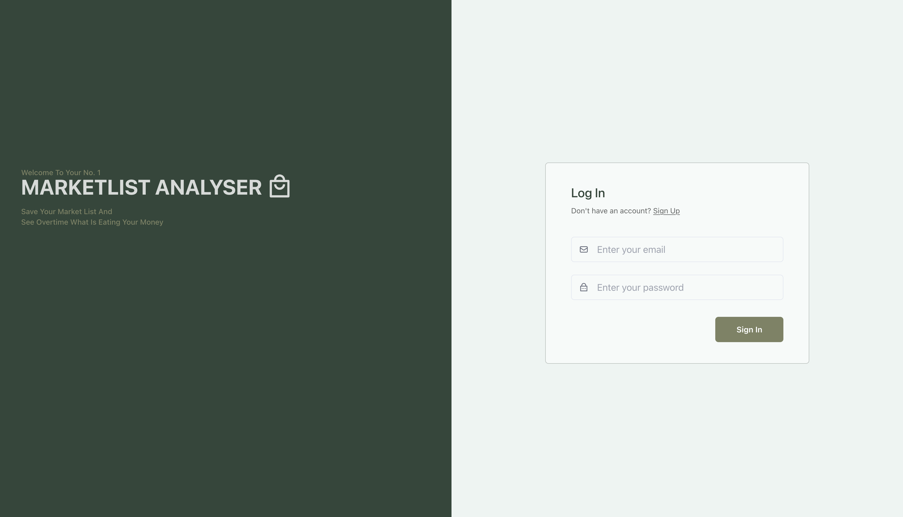

# Market Todo List

This project was done out of my need to keep a list of my current spending in terms of going to the market to get food and essential products, so i could know (keep track of) which product i bought often and how often i bought it. So as a dev bro! I decided to build something to that effect.

I used react.js for the front end and node js for the backend.

For the front-end i used React.js, react-router-dom for the client side routing, react-icons for the icons, react-hook-form for managing the forms and inputs, zustand for the state management and tanstack query for the for managing async data state, uuid for unique keys, jwt-decode to decode the token sent from the backend.

For the backend i used node js with expressjs, and mongodb as my database of choice, zod for validation of data sent to the backend, bcryptjs for encryption of user data.


## Screenshots




## Run Locally

Clone the project

```bash
  git clone https://link-to-project
```

Go to the project directory

```bash
  cd my-project
```

Install dependencies

```bash
  npm install
```

Start the server

```bash
  npm run dev
```

